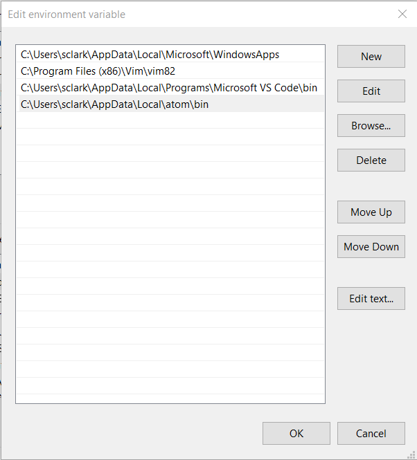

# Set Up Atom

## Install Atom and apm

1. Install Atom
1. Verify you have apm installed: `apm help install`

    > #### Troubleshooting
    >
    > If you get a package not found error, try restarting the Atom application. 
    > 
    > The atom/apm packages are automatically added to your path. 
    >
    > For example, on Windows you should see this in your user environment variables list:  `C:\Users\username\AppData\Local\atom\bin`
    >
    > 

1. Install a terminal: `apm install terminus`

## Install Other Useful Packages

These packages are generally useful on any project, regardless of language.

* project-manager
* file-icons 
* highlight-selected 
* autocomplete-paths 
* copy-path 
* auto-update-plus 
* open-recent 
* pane-layout-plus 
* expose 
* minimap 
* pigments 
* atom-beautify 
* ask-stack 
* clipboard-plus 
* busy-signal 
* hyperclick 
* linter 
* linter-ui
* prettier-atom 
* sort-lines 
* tree-view-copy-relative-path

> Note: `markdown-preview` is a built-in package. There is also `markdown-preview-plus`, which I haven't tried.

```
apm install project-manager file-icons highlight-selected autocomplete-paths copy-path auto-update-plus open-recent pane-layout-plus expose minimap pigments atom-beautify ask-stack clipboard-plus busy-signal hyperclick linter prettier-atom sort-lines tree-view-copy-relative-path
```
These packages should now be located in C:\Users\username\.atom\packages.

## Install Project-Specific Packages

#### HTML & JS
```
apm install emmet autoclose-html less-than-slash linter-eslint jquery-snippets atom-ternjs linter linter-ui
```

#### git
```
apm install github git-diff git-time-machine git-plus sync-settings
```

#### GitHub
```
apm install github
```

#### LaTex and markdown
```
apm install language-latex language-todotxt latex linter-chktex markdown-table-editor
```

## Settings and Themes

#### Favorite combinations
* UI theme: `apm install atom-dark`
* Syntax theme: `apm install base16-papercolor-light-syntax`

#### UI themes
```
apm install atom-dark
apm install native-ui
```

#### Syntax themes
```
apm install oceanic-next
apm install base16-papercolor-light-syntax
```

## Resources
- [Best Atom Packages for Front-End](https://www.shopify.com/partners/blog/best-atom-packages)
- [Best Atom packages for a front-end developer](https://medium.com/@papaponmx/best-atom-packages-for-a-front-end-developer-6aef14b961f0)
- [Best Packages & Themes for Atom Danny Paton](https://medium.com/@Dannypaton/the-best-packages-and-themes-for-atom-fee4860a7955)
