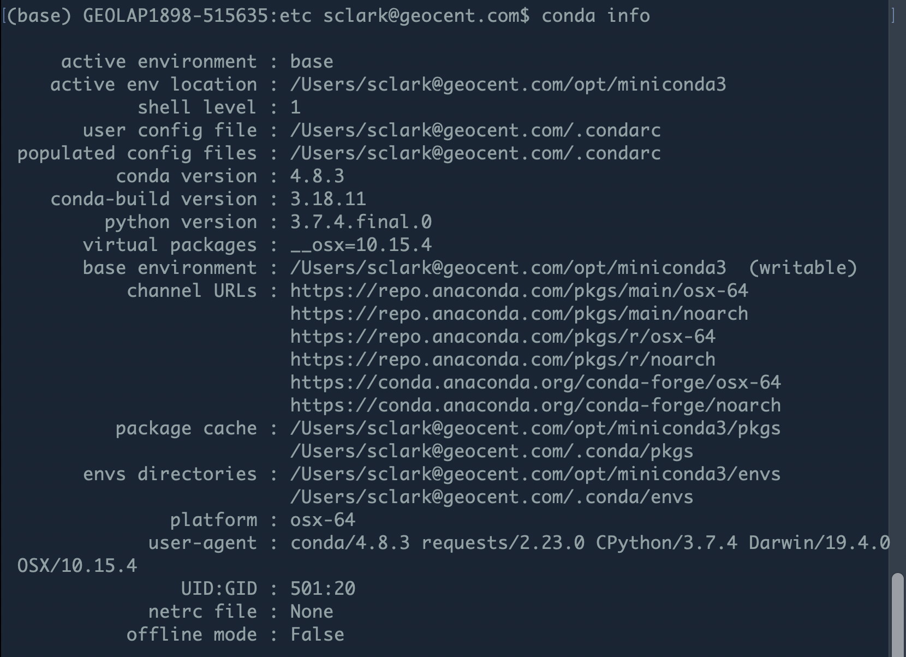
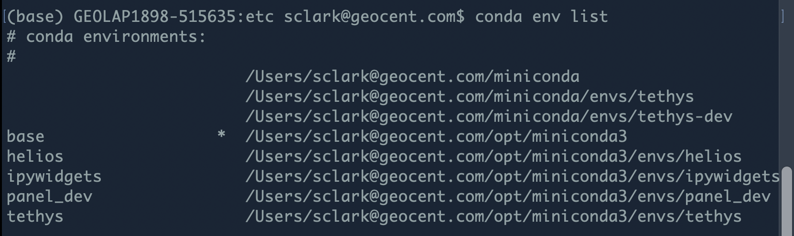

# Conda

```
conda update -n base -c defaults conda
```

```
conda install -c pyviz/label/dev panel=0.10.0a25
```

## Useful commands
$ conda info


$ conda env list


Miniconda3 installer installs the library in /opt/ folder no matter what.

Create a new conda env
```
conda create --name helios
```

```
conda env update --file environment.yml
conda env update --name helios --file environment.yml
```

https://stackoverflow.com/questions/49474575/how-to-install-my-own-python-module-package-via-conda-and-watch-its-changes

```
conda remove --name <envname> --all
```

## Resources
- Official Docs:  https://conda.io/projects/conda/en/latest/
- Cheat Sheet:  https://conda.io/projects/conda/en/latest/user-guide/cheatsheet.html
- Guide to Conda Environments:  https://towardsdatascience.com/a-guide-to-conda-environments-bc6180fc533
